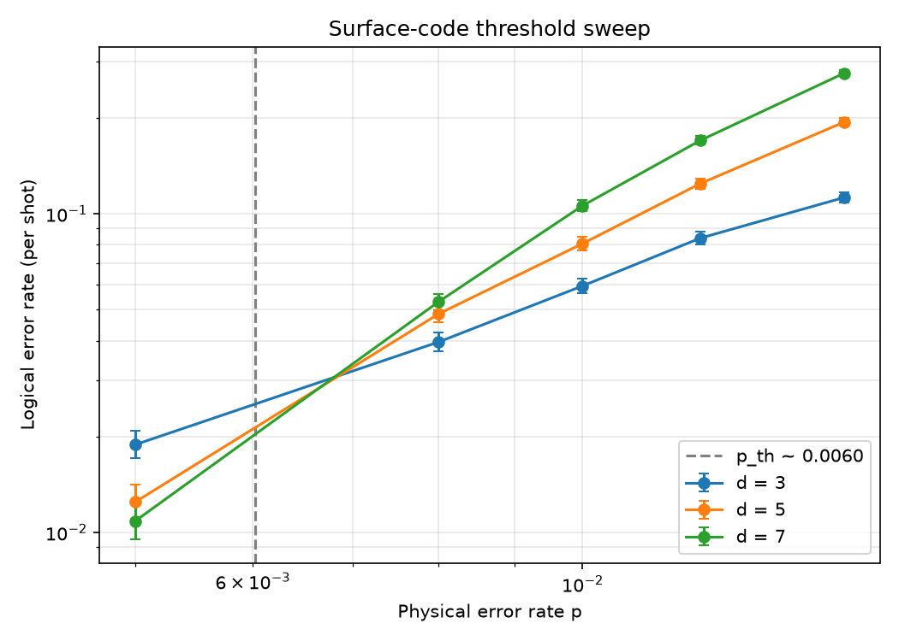
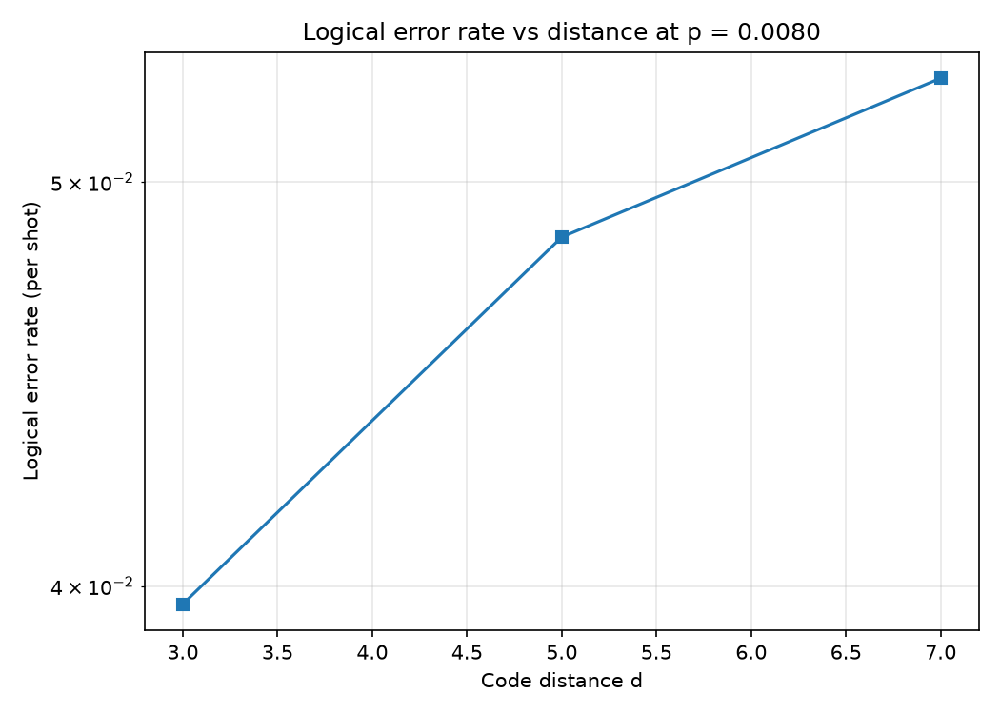
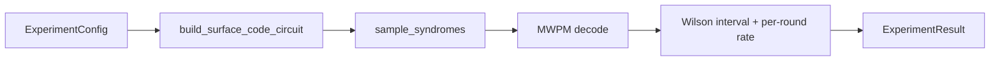

# Surface Code Simulator

Circuit-level Monte Carlo simulation of the rotated/unrotated surface code, built on
[Stim](https://github.com/quantumlib/Stim) and [PyMatching](https://pymatching.readthedocs.io/).
It creates a surface-code lattice, injects circuit-level noise, extracts syndromes, decodes
with minimum-weight perfect matching, and tracks logical failures to produce threshold plots
and syndrome heatmaps.

This is repo 1 of a ten-part [QEC research portfolio](https://github.com/afogelis/qec-portfolio); the decoder zoo,
ML decoders, dashboard, resource model, and paper reproductions build on top of it.

## Results at a glance



*Threshold sweep. The distance curves cross near p_th ~ 0.6%; below the crossing, larger distance lowers the logical error rate.*



*Exponential suppression of the logical error rate with code distance at p = 0.008.*

## What this demonstrates

- **Quantum information:** surface-code memory experiments, detector error models, MWPM decoding.
- **Statistics:** Wilson confidence intervals, per-round error rates, finite-size threshold crossing.
- **Software engineering:** typed Pydantic configs, RORO interfaces, a CLI, CI, and tests against the real Stim/PyMatching stack.
- **Visualization:** threshold sweeps, logical-error-vs-distance scaling, syndrome heatmaps.

## What I wrote vs what I integrated

This repository is honest about leaning on best-in-class libraries. The split is deliberate:

| Integrated (existing, world-class tools) | Authored here |
|------------------------------------------|---------------|
| [Stim](https://github.com/quantumlib/Stim) for circuit generation, noise injection and syndrome sampling | The end-to-end experiment pipeline tying these together with typed configs |
| [PyMatching](https://pymatching.readthedocs.io/) for MWPM decoding | Wilson-interval statistics and the per-round error-rate derivation |
| | The finite-size threshold-crossing estimator and its sweep harness |
| | The visualization layer and the JSON data contracts consumed by downstream repos |

In other words, this is an *experiment pipeline and statistics layer* on top of Stim and PyMatching,
not a re-implementation of a stabilizer simulator or a matching decoder. The genuinely algorithmic
work in the portfolio lives downstream: the from-scratch union-find and belief-propagation decoders
in [`decoder-benchmark`](https://github.com/afogelis/decoder-benchmark) and the exact
maximum-likelihood decoder in
[`decoder-accuracy-reproduction`](https://github.com/afogelis/decoder-accuracy-reproduction).

## Install

```bash
git clone https://github.com/afogelis/surface-code-simulator
cd surface-code-simulator
pip install -e ".[dev]"
```

## Quick start

```bash
pytest
python examples/quick_threshold.py        # writes outputs/*.png
```

```bash
# Single memory experiment (JSON summary to stdout)
surfacecode run --distance 5 --rounds 5 --p 0.001 --shots 50000

# Threshold sweep saved to JSON for the dashboard / paper-repro repos
surfacecode sweep --distances 3,5,7 --p 0.005,0.008,0.01,0.012 --shots 20000 --output outputs/sweep.json
```

## Library usage

```python
from surfacecode import ExperimentConfig, run_memory_experiment, run_threshold_sweep

result = run_memory_experiment(ExperimentConfig(distance=5, rounds=5, p=0.001, shots=50_000))
print(result.logical_error_rate, result.ci_low, result.ci_high)

sweep = run_threshold_sweep(distances=[3, 5, 7], error_rates=[0.005, 0.01, 0.015], shots=20_000)
print(sweep.threshold_estimate)
```

## How it works



A single physical error rate `p` drives every circuit-level noise channel (gate depolarization,
reset/measurement flips, idle depolarization) exposed by Stim's generated circuits. Below
threshold, increasing the code distance lowers the logical error rate; the crossing of curves
for different distances estimates the threshold `p_th`.

## Layout

- `src/surfacecode/` — library (`circuits`, `sampling`, `decoding`, `metrics`, `threshold`, `experiment`, `viz/`, `cli`)
- `tests/` — pytest, including end-to-end Stim/PyMatching integration tests
- `examples/` — runnable demo
- `notebooks/` — threshold + heatmap walkthrough
- `.github/workflows/ci.yml` — CI on push

## Notes on scope

For very large sweeps, [`sinter`](https://pypi.org/project/sinter/) (a dependency here) is the
production tool for parallelised Monte Carlo; this repo keeps a transparent, single-process sweep
so the statistics are easy to read and test. The full decoder comparison (union-find, belief
propagation, ML) lives in the companion `decoder-benchmark` repo.

## License

MIT — see [LICENSE](LICENSE).
